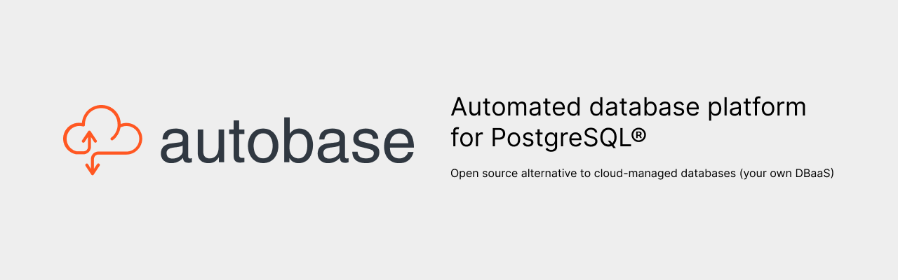

<p align="center">
  
</p>

# Autobase for PostgreSQL® :elephant: :sparkling_heart:

[](https://github.com/vitabaks/autobase/actions/workflows/ansible-lint.yml)
[](https://github.com/vitabaks/autobase/actions/workflows/yamllint.yml)
[](https://github.com/vitabaks/autobase/actions/workflows/flake8.yml)
[](https://github.com/vitabaks/autobase/actions/workflows/molecule.yml)
[](https://github.com/vitabaks/autobase/blob/master/LICENSE)
<a href="https://algora.io/autobase/bounties/new">
  
</a>

**Autobase for PostgreSQL®** is an open-source alternative to cloud-managed databases (DBaaS) such as Amazon RDS, Google Cloud SQL, Azure Database, and more.

This automated database platform enables you to create and manage production-ready, highly available PostgreSQL clusters. It simplifies the deployment process, reduces operational costs, and makes database management accessible—even for teams without specialized expertise.

**Automate deployment, failover, backups, restore, upgrades, scaling, and more with ease.**

You can find a version of this documentation that is searchable and also easier to navigate at [autobase.tech](https://autobase.tech)

---

### Project Status

Autobase has been actively developed for over 5 years (since 2019) and is trusted by companies worldwide, including in production environments with high loads and demanding reliability requirements. Our mission is to provide an open-source DBaaS that delivers reliability, flexibility, and cost-efficiency.

The project will remain open-source forever, but to ensure its continuous growth and development, we rely on [sponsorship](https://autobase.tech/docs/sponsor). By subscribing to [Autobase packages](https://autobase.tech/docs/support), you gain access to personalized support from the project authors and PostgreSQL experts, ensuring the reliability of your database infrastructure.

---

### Supported setups of Postgres Cluster


You have three schemes available for deployment:

#### 1. PostgreSQL High-Availability only

This is simple scheme without load balancing.

##### Components:

- [**Patroni**](https://github.com/zalando/patroni) is a template for you to create your own customized, high-availability solution using Python and - for maximum accessibility - a distributed configuration store like ZooKeeper, etcd, Consul or Kubernetes. Used for automate the management of PostgreSQL instances and auto failover.

- [**etcd**](https://github.com/etcd-io/etcd) is a distributed reliable key-value store for the most critical data of a distributed system. etcd is written in Go and uses the [Raft](https://raft.github.io/) consensus algorithm to manage a highly-available replicated log. It is used by Patroni to store information about the status of the cluster and PostgreSQL configuration parameters. [What is Distributed Consensus?](https://thesecretlivesofdata.com/raft/)

- [**vip-manager**](https://github.com/cybertec-postgresql/vip-manager) (_optional, if the `cluster_vip` variable is specified_) is a service that gets started on all cluster nodes and connects to the DCS. If the local node owns the leader-key, vip-manager starts the configured VIP. In case of a failover, vip-manager removes the VIP on the old leader and the corresponding service on the new leader starts it there. Used to provide a single entry point (VIP) for database access.

- [**PgBouncer**](https://pgbouncer.github.io/features.html) (optional, if the `pgbouncer_install` variable is `true`) is a connection pooler for PostgreSQL.

#### 2. PostgreSQL High-Availability with Load Balancing

This scheme enables load distribution for read operations and also allows for scaling out the cluster with read-only replicas.

When deploying to cloud providers such as AWS, GCP, Azure, DigitalOcean, and Hetzner Cloud, a cloud load balancer is automatically created by default to provide a single entry point to the database (controlled by the `cloud_load_balancer` variable).

For non-cloud environments, such as when deploying on Your Own Machines, the HAProxy load balancer is available for use. To enable it, set `with_haproxy_load_balancing: true` variable.

> [!NOTE]
> Your application must have support sending read requests to a custom port 5001, and write requests to port 5000.

List of ports when using HAProxy:

- port 5000 (read / write) master
- port 5001 (read only) all replicas
- port 5002 (read only) synchronous replica only
- port 5003 (read only) asynchronous replicas only

##### Components of HAProxy load balancing:

- [**HAProxy**](https://www.haproxy.org/) is a free, very fast and reliable solution offering high availability, load balancing, and proxying for TCP and HTTP-based applications.

- [**confd**](https://github.com/kelseyhightower/confd) manage local application configuration files using templates and data from etcd or consul. Used to automate HAProxy configuration file management.

- [**Keepalived**](https://github.com/acassen/keepalived) (_optional, if the `cluster_vip` variable is specified_) provides a virtual high-available IP address (VIP) and single entry point for databases access.
  Implementing VRRP (Virtual Router Redundancy Protocol) for Linux. In our configuration keepalived checks the status of the HAProxy service and in case of a failure delegates the VIP to another server in the cluster.

#### 3. PostgreSQL High-Availability with Consul Service Discovery

To use this scheme, specify `dcs_type: consul` variable.

This scheme is suitable for master-only access and for load balancing (using DNS) for reading across replicas. Consul [Service Discovery](https://developer.hashicorp.com/consul/docs/concepts/service-discovery) with [DNS resolving ](https://developer.hashicorp.com/consul/docs/discovery/dns) is used as a client access point to the database.

Client access point (example):

- `master.postgres-cluster.service.consul`
- `replica.postgres-cluster.service.consul`

Besides, it can be useful for a distributed cluster across different data centers. We can specify in advance which data center the database server is located in and then use this for applications running in the same data center.

Example: `replica.postgres-cluster.service.dc1.consul`, `replica.postgres-cluster.service.dc2.consul`

It requires the installation of a consul in client mode on each application server for service DNS resolution (or use [forward DNS](https://developer.hashicorp.com/consul/tutorials/networking/dns-forwarding?utm_source=docs) to the remote consul server instead of installing a local consul client).

## Compatibility

RedHat and Debian based distros (x86_64)

###### Supported Linux Distributions:

- **Debian**: 11, 12
- **Ubuntu**: 22.04, 24.04
- **CentOS Stream**: 9
- **Oracle Linux**: 8, 9
- **Rocky Linux**: 8, 9
- **AlmaLinux**: 8, 9

###### PostgreSQL versions:

all supported PostgreSQL versions

:white_check_mark: tested, works fine: PostgreSQL 10, 11, 12, 13, 14, 15, 16, 17

_Table of results of daily automated testing of cluster deployment:_
| Distribution | Test result |
|--------------|:----------:|
| Debian 11 | [](https://github.com/vitabaks/autobase/actions/workflows/schedule_pg_debian11.yml) |
| Debian 12 | [](https://github.com/vitabaks/autobase/actions/workflows/schedule_pg_debian12.yml) |
| Ubuntu 22.04 | [](https://github.com/vitabaks/autobase/actions/workflows/schedule_pg_ubuntu2204.yml) |
| Ubuntu 24.04 | [](https://github.com/vitabaks/autobase/actions/workflows/schedule_pg_ubuntu2404.yml) |
| CentOS Stream 9 | [](https://github.com/vitabaks/autobase/actions/workflows/schedule_pg_centosstream9.yml) |
| Oracle Linux 8 | [](https://github.com/vitabaks/autobase/actions/workflows/schedule_pg_oracle_linux8.yml) |
| Oracle Linux 9 | [](https://github.com/vitabaks/autobase/actions/workflows/schedule_pg_oracle_linux9.yml) |
| Rocky Linux 8 | [](https://github.com/vitabaks/autobase/actions/workflows/schedule_pg_rockylinux8.yml) |
| Rocky Linux 9 | [](https://github.com/vitabaks/autobase/actions/workflows/schedule_pg_rockylinux9.yml) |
| AlmaLinux 8 | [](https://github.com/vitabaks/autobase/actions/workflows/schedule_pg_almalinux8.yml) |
| AlmaLinux 9 | [](https://github.com/vitabaks/autobase/actions/workflows/schedule_pg_almalinux9.yml) |

## Getting Started

You have the option to deploy Postgres clusters using the Console (UI), command line, or GitOps.

> [!TIP]
> 📩 Contact us at info@autobase.tech, and our team will help you implement Autobase into your infrastructure.

### Console (UI)

The Autobase Console (UI) is the recommended method for most users. It is designed to be user-friendly, minimizing the risk of errors and making it easier than ever to set up your PostgreSQL clusters. This method is suitable for both beginners and those who prefer a visual interface for managing their PostgreSQL clusters.

To run the autobase console, execute the following command:

```
docker run -d --name autobase-console \
  --publish 80:80 \
  --publish 8080:8080 \
  --env PG_CONSOLE_API_URL=http://localhost:8080/api/v1 \
  --env PG_CONSOLE_AUTHORIZATION_TOKEN=secret_token \
  --env PG_CONSOLE_DOCKER_IMAGE=autobase/automation:latest \
  --volume console_postgres:/var/lib/postgresql \
  --volume /var/run/docker.sock:/var/run/docker.sock \
  --volume /tmp/ansible:/tmp/ansible \
  --restart=unless-stopped \
  autobase/console:latest
```

> [!NOTE]
> If you are running the console on a dedicated server (rather than on your laptop), replace `localhost` with the server’s IP address in the `PG_CONSOLE_API_URL` variable.

> [!TIP]
> It is recommended to run the console in the same network as your database servers to enable monitoring of the cluster status.

Alternatively, you can use [Docker Compose](console/README.md).

**Open the Console UI**:

Go to http://localhost:80 (or the address of your server) and use `secret_token` for authorization.


Refer to the [Deployment](https://autobase.tech/docs/category/deployment) section to learn more about the different deployment methods.

### Command line

<details><summary>Click here to expand... if you prefer the command line.</summary><p>

The command line mode is suitable for advanced users who require greater flexibility and control over the deployment and management of their PostgreSQL clusters.
While the Console (UI) is designed for ease of use and is suitable for most users, the command line provides powerful options for those experienced in automation and configuration.

0. [Install Ansible](https://docs.ansible.com/ansible/latest/installation_guide/intro_installation.html) on one control node (which could easily be a laptop)

```sh
sudo apt update && sudo apt install -y python3-pip sshpass git
pip3 install ansible
```

1. Install the Autobase Collection

Install directly from Ansible Galaxy:

```sh
ansible-galaxy collection install vitabaks.autobase
```

Or include it in your requirements.yml:

```yaml
collections:
  - name: vitabaks.autobase
    version: 2.2.0
```

2. Prepare your inventory

See the example [inventory](https://github.com/vitabaks/autobase/blob/master/automation/inventory.example) file. Specify internal IP addresses and connection details such as `ansible_user`, `ansible_ssh_pass`, or `ansible_ssh_private_key_file`.

3. Define variables

Review default [variables](https://github.com/vitabaks/autobase/blob/master/automation/roles/common/defaults/main.yml). Override them in your inventory, group_vars, or other appropriate locations.

4. Use Autobase playbook

```yaml
- name: Run Autobase deployment
  ansible.builtin.include_playbook: vitabaks.autobase.deploy_pgcluster
```

Note: Start with `deploy_pgcluster`, and use `config_pgcluster` later for reconfiguration.

### How to start from scratch

If you need to start from the very beginning, you can use the `remove_cluster` playbook.

Available variables:
- `remove_postgres`: stop the PostgreSQL service and remove data
- `remove_etcd`: stop the ETCD service and remove data
- `remove_consul`: stop the Consul service and remove data

⚠️ Caution: Only use this in non-production or when you’re absolutely sure.

</p></details>

## Star us

If you find our project helpful, consider giving it a star on GitHub! Your support helps us grow and motivates us to keep improving. Starring the project is a simple yet effective way to show your appreciation and help others discover it.

<a href="https://star-history.com/#vitabaks/autobase&Date">
  <picture>
    <source media="(prefers-color-scheme: dark)" srcset="https://api.star-history.com/svg?repos=vitabaks/autobase&type=Date&theme=dark" />
    <source media="(prefers-color-scheme: light)" srcset="https://api.star-history.com/svg?repos=vitabaks/autobase&type=Date" />
    
  </picture>
</a>

## Sponsor this project

By sponsoring our project, you directly contribute to its continuous improvement and innovation. As a sponsor, you'll receive exclusive benefits, including personalized support, early access to new features, and the opportunity to influence the project's direction. Your sponsorship is invaluable to us and helps ensure the project's sustainability and progress.

Become a sponsor today and help us take this project to the next level!

Support our work through [GitHub Sponsors](https://github.com/sponsors/vitabaks)

[](https://github.com/sponsors/vitabaks)

Support our work through [Patreon](https://www.patreon.com/vitabaks)

[](https://patreon.com/vitabaks)

## License

Licensed under the MIT License. See the [LICENSE](./LICENSE) file for details.

## Author

Vitaliy Kukharik (PostgreSQL DBA) \
vitaliy@autobase.tech

## Feedback, bug-reports, requests, ...

Are [welcome](https://github.com/vitabaks/autobase/issues)!
